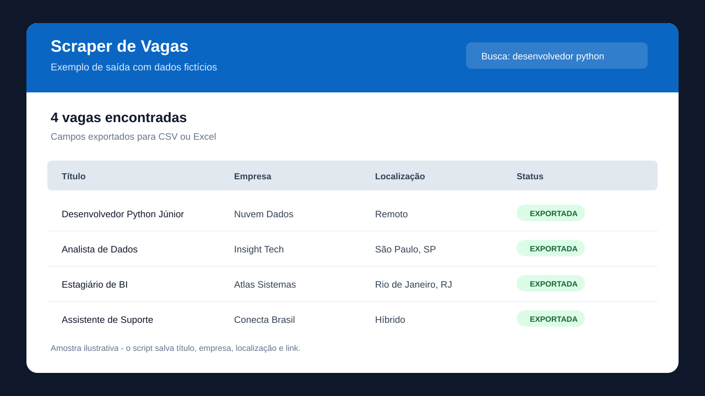

# Scraper de vagas do LinkedIn

Projeto educacional para coletar e salvar informacoes visiveis em resultados publicos de busca de vagas.

## Previa visual

## O que o projeto demonstra

- automacao de navegador com Selenium;
- parametros de linha de comando;
- tratamento de erros e encerramento seguro do navegador;
- limpeza de dados duplicados;
- exportacao em CSV ou XLSX.

## Como executar

    python -m venv .venv
    .\.venv\Scripts\Activate.ps1
    python -m pip install -r requirements.txt
    python scraper.py --keywords 'desenvolvedor python' --location Brasil --limit 20

Para salvar em Excel, informe um arquivo com extensao .xlsx:

    python scraper.py --output vagas.xlsx

## Uso responsavel

Use o projeto apenas para aprendizado e em conformidade com os termos de uso da plataforma consultada. O layout e os seletores de paginas externas podem mudar; este codigo nao tenta contornar login, CAPTCHA ou controles de acesso.
